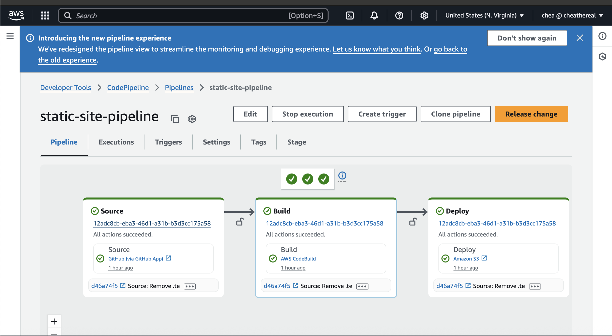
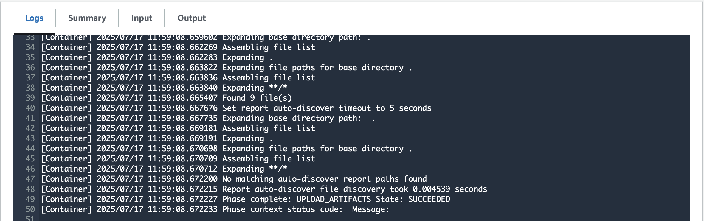
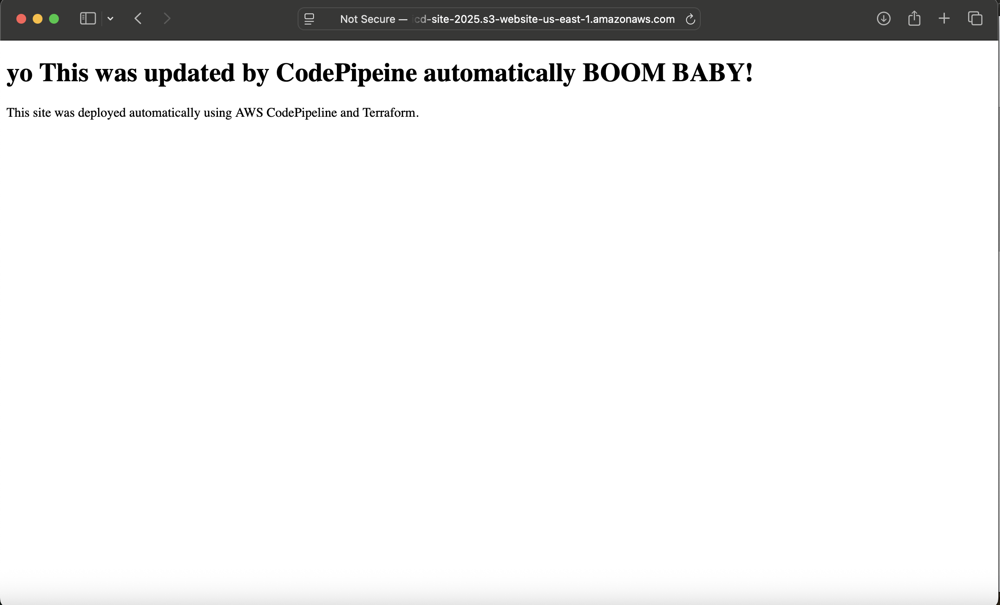

# Terraform AWS CI/CD Static Website Pipeline

This project demonstrates a complete **CI/CD pipeline** for deploying a static website to AWS S3 using:

- Terraform (IaC)
- AWS CodePipeline (CI/CD orchestration)
- AWS CodeBuild (build & artifact management)
- GitHub (source code repository)

---

## Project Overview

This pipeline automatically deploys changes pushed to the `main` branch of the GitHub repository to an S3 bucket configured to host a static website.

The infrastructure is fully defined using Terraform, including:

- S3 bucket with static website hosting
- IAM roles and policies for CodeBuild and CodePipeline
- CodeBuild project that builds the website (runs simple buildspec)
- CodePipeline that connects GitHub source → build → deploy stages

---

## How It Works

1. **Push to GitHub**: When a commit is pushed to the `main` branch, GitHub triggers the AWS CodePipeline.
2. **CodePipeline Source Stage**: Pulls the latest code from GitHub via CodeStar connection.
3. **CodeBuild Stage**: Runs the buildspec.yml, which in this case just prepares files for deployment.
4. **Deploy Stage**: Uploads the built files to the S3 bucket.
5. **Static Website Live**: Your website is available via the S3 website endpoint.

---

## Prerequisites

- AWS account with permissions to create IAM roles, S3 buckets, CodeBuild, and CodePipeline resources.
- Terraform installed locally.
- AWS CLI configured with credentials.
- GitHub repository with your website files and this Terraform code.

---

## Setup & Deployment

1. Clone this repository:

   ```bash
   git clone https://github.com/CheaTheReal/terraform-s3-cicd-pipeline.git
   cd terraform-s3-cicd-pipeline

2. Edit terraform.tfvars with your values:

   bucket_name    = "your-unique-s3-bucket-name"
   repo_name      = "YourGitHubUser/terraform-s3-cicd-pipeline"
   branch         = "main"
   connection_arn = "arn:aws:codeconnections:region:account-id:connection/your-connection-id"

3. Initialize Terraform:

   terraform init

4. Apply the infrastructure: 

   terraform apply -var-file="terraform.tfvars"

5. After successful apply, your pipeline and S3 website will be created.

6. Push changes to the main branch in GitHub to trigger the pipeline.

Testing Your Pipeline

Make a simple change in index.html (e.g., edit header text).
Commit and push your change to GitHub.
Go to AWS Console → CodePipeline → static-site-pipeline to watch the deployment.
Visit your S3 website URL (shown as output by Terraform) to confirm the update.

Technologies Used

Terraform
AWS S3
AWS IAM
AWS CodeBuild
AWS CodePipeline
GitHub
Author

Fernando Perez (CheaTheReal)
GitHub Profile

License

This project is licensed under the MIT License.

## Screenshots

### CodePipeline Pipeline Status  


### CodeBuild Build Logs  


### Deployed Static Site  


